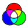

<h1 align="center">
  RGBfun
</h1>

  

## 1. Introduction

RGB Fun is a Flutter app that allows users to explore and save randomly generated colors. The motivation behind RGB Fun is to create a fun and engaging way to explore color spaces and possibly discover unique color combinations. I also wanted to try out the Flutter widgets.

## 2. Features

- Generate a new random color by tapping anywhere on the screen.
- The color currently on display can be added to or removed from favorites.
- View a list of favorite colors, stored persistently between app launches.
- Each color is displayed in hexadecimal representation.

## 3. Dependencies

The RGB Fun app depends on a few external libraries:

- [`flutter`](https://api.flutter.dev/): The Flutter SDK, which provides the fundamental framework and tools to build apps for mobile, web, and desktop from a single codebase.
- [`provider`](https://pub.dev/packages/provider): (version ^6.0.5) Used for state management in the application. It allows efficient propagation of changes across the widget tree, making it easier to manage and manipulate state in a clean way.
- [`hive`](https://pub.dev/packages/hive): (version ^2.2.3) A lightweight and key-value database. It is used to store favorite colors persistently. It's a good alternative to other heavier databases like SQLite, especially for simple applications like RGB Fun.
- [`hive_flutter`](https://pub.dev/packages/hive_flutter): (version ^1.1.0) Flutter-specific additions for Hive. This package provides the `Hive.initFlutter` method which is used for initializing Hive in a Flutter environment. It's a wrapper around Hive and it simplifies the initialization process.

Development dependencies:

- [`flutter_test`](https://api.flutter.dev/flutter/flutter_test/flutter_test-library.html): (version - latest) Provides a rich set of testing features to test your Flutter applications.
- [`hive_generator`](https://pub.dev/packages/hive_generator): (version ^2.0.0) Used for code generation for Hive, specifically for generating TypeAdapters that allow Hive to store custom types.
- [`build_runner`](https://pub.dev/packages/build_runner): (version ^2.4.4) A build system for Dart, used to generate the boilerplate code needed for Hive. It is a development dependency as it is not needed in the final app package.

## 4. Example Widgets & Functions

Some of the core widgets and functions used in this app include:

- `MyApp`: This is the root widget of the application that includes the `MaterialApp` widget, allowing you to use material design in your app.
- `ChangeNotifierProvider`: This is a widget from the provider package used for state management. It wraps around the `MyApp` widget, providing the instance of `FavoritesModel` to all the descendants that are listening to it.
- `MaterialApp`: This widget is a convenience widget that wraps a number of widgets that are commonly required for applications implementing Material Design.
- `MyHomePage`: This is a stateful widget and it's the home page of the app. It contains the logic of generating random colors and switching between home and favorites page.
- `Scaffold`: Provides a framework to implement the basic material design visual layout structure. It's used inside the `build` method of the `MyHomePage` widget.
- `AppBar`: A material design app bar. It appears at the top of the app and contains the app's title.
- `BottomNavigationBar`: This widget is a material widget that's displayed at the bottom of an app for selecting among a small number of views. It's used for switching between home and favorites page.
- `HomePage`: This stateless widget represents the home page which displays the current color and a favorite button to add or remove the color from the favorites.
- `ColorDisplay`: A custom stateless widget to display the current color and its hexadecimal code string representation.
- `FavoritesPage`: This stateless widget represents the favorites page, which displays a list of all saved favorite colors.
- `InkWell`: This widget provides Material ink splash interactivity to its child widget. It's used inside the `ColorDisplay` widget so that when a user taps on the color, a new random color is generated.
- `AnimatedContainer`: This widget is a container that gradually changes its values over a period of time. It's used to smoothly transition between colors when a new random color is generated.
- `ListView`: This widget is a scrollable list of widgets arranged linearly. It's used in the `FavoritesPage` widget to display a list of all saved favorite colors.
- `Consumer<FavoritesModel>`: A widget that listens to `FavoritesModel` and asks the widget tree to rebuild any time the model changes. It's used in the `FavoritesPage` widget to rebuild the list when favorites list changes.
- `_colorToHexString`: This function converts the provided color into a hexadecimal string. This string is displayed on both the home and favorites pages.
- `FavoritesModel`: This class extends `ChangeNotifier` and holds the state of the application. It's used to manage the favorites list.
- `ColorAdapter`: This class extends `TypeAdapter` from the Hive package. It's used to store and retrieve `Color` objects from Hive database.

## 5. License

Software licensed under the MIT Licence.
